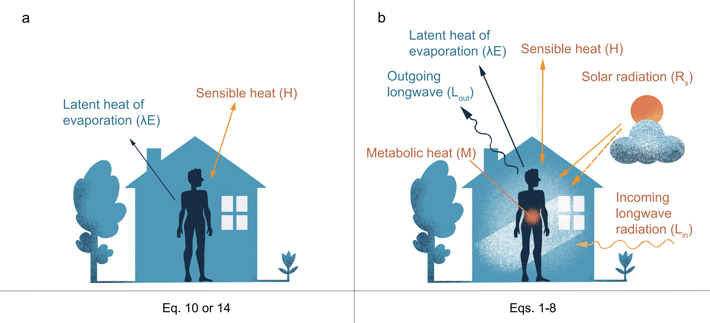
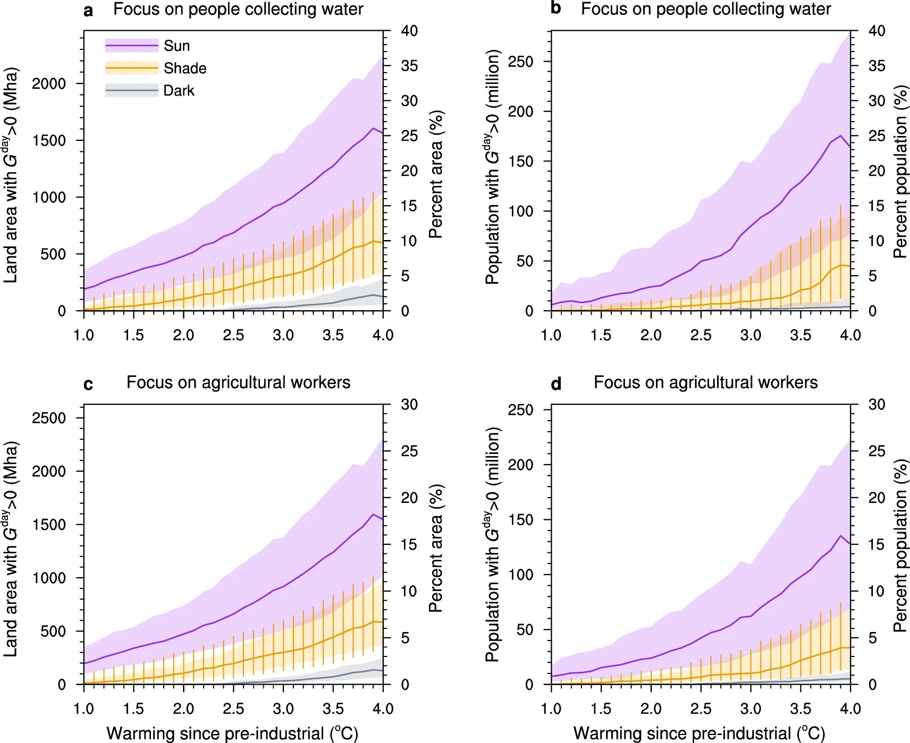
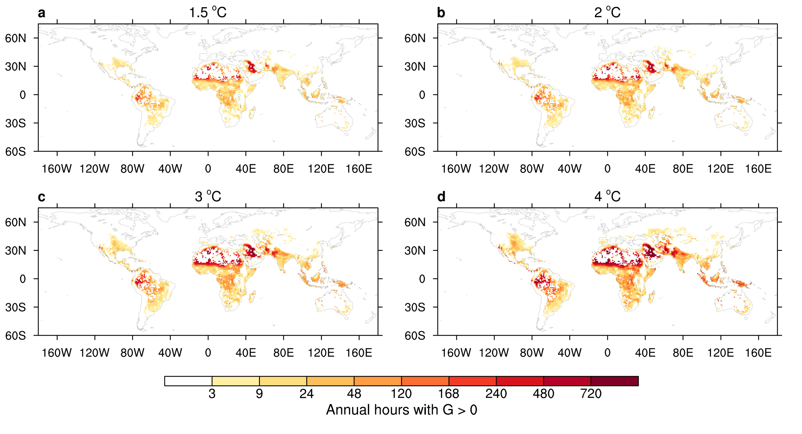

**清华新闻网12月16日电** 随着全球气候变化加剧，极端高温天气对人类健康的威胁日益突出。不可补偿热应激是一种极端的热应激状态，即身体散热的能力不足以抵消环境热量的输入，使得健康的个体即使采取充分休息和补水等预防措施，仍然会出现核心体温上升的情况（如不进行干预，热射病和死亡将无法避免）。以往研究主要关注室内环境，假设太阳辐射可以完全避免，但是忽略了无法避免户外活动的脆弱群体，例如全球大约8.5亿农民和7亿需要户外取水的人群。

<!--more-->

近日，清华大学深圳国际研究生院环境与生态研究院范远超团队及其合作者在研究全球变暖对人类健康影响方面取得重要突破。研究团队首次在全球尺度定量评估了户外湿热、太阳辐射及生理特征等因素对热应激的影响，揭示了此前研究严重低估全球变暖带来的户外健康风险。研究结果表明，在全球升温2°C的情况下，将有数千万无法避免户外活动的人群面临致命热应激风险，这一数字在全球升温4°C时将攀升至数亿人。

研究团队开发了一套精确且简约的人体热响应模型，首次将温度、湿度、太阳辐射和风速等户外动态环境因素和几种关键的生理约束同时纳入考量（图1），并用第六次耦合模式比对项目（CMIP6）中的12个地球系统模式的未来气候预测作为输入进行全球热应激的定量评估。该方法的创新在于，传统热应激研究主要依赖于如湿球温度等描述人体外部因素的经验指数，其参数一般校准于当下气候和特定人群，无法外推到未来或其他人群，而该团队所开发的模型直接描述人体反应并可适用于任何气候情景和人群。

研究发现，本世纪预期面临不可补偿热应激的户外活动人口将比以往室内研究多出数千万。具体来说，在全球变暖2°C的情景下，预计有2400万农民或户外取水的人口（图2b,d）平均每年将经历8天（或96小时，图3b）不可补偿热应激。当升温4°C时，将有1.3亿农民或1.6亿户外取水人口平均每年受到14天（或168小时，图3）不可补偿热应激的影响。如果考虑其他户外活动人口如建筑工人或快递员，或老年及亚健康人群，影响将更为广泛。即使在有遮阳条件下，暴露于不可补偿热应激的人口数量也比此前完全忽视辐射影响的研究预测高出六倍以上。热带地区，尤其是南亚、非洲北部、南美和中东部分地区将首当其冲，中国华东华南地区也在接近这些危险条件（图3）。

此外，研究表明受极端热应激事件影响的人群将不得不考虑把户外活动时间转移到夜间或清晨（18:00至9:00之间），但这种改变将会带来一系列的社会、经济影响和安全隐患。

研究负责人范远超表示：“我们的模型将气候研究和生理学研究相结合，为跨领域合作搭建了一座桥梁，能更准确地评估各种气候条件下的热应激健康风险。”研究的合作者凯金·麦科尔（Kaighin McColl）说：“对于气候变化，也许最大的未知是：我们将允许地球变暖到什么程度？这取决于我们自己。为了避免不可补偿热应激带来的最严重影响，我们需要迅速淘汰化石燃料，将全球升温控制在2°C以下。”

相关研究成果以“全球变暖导致广泛的户外不可补偿热应激风险”（Widespread outdoor exposure touncompensable heat stress with warming）为题，于12月12日发表于《自然》（Nature）系列期刊《通讯·地球与环境》（Communications Earth & Environment）。

清华大学深圳国际研究生院助理教授范远超为论文第一作者及通讯作者，哈佛大学地球与行星科学系助理教授凯金·麦科尔（Kaighin McColl）为论文第二作者及共同通讯作者。研究得到深圳市科技创新委员会、鹏城孔雀计划特聘岗位科研启动基金和哈佛大学太阳能地球工程研究计划奖学金的资助。

TOPICS: Climate Change, Heatwaves
https://doi.org/10.1038/s43247-024-01930-6